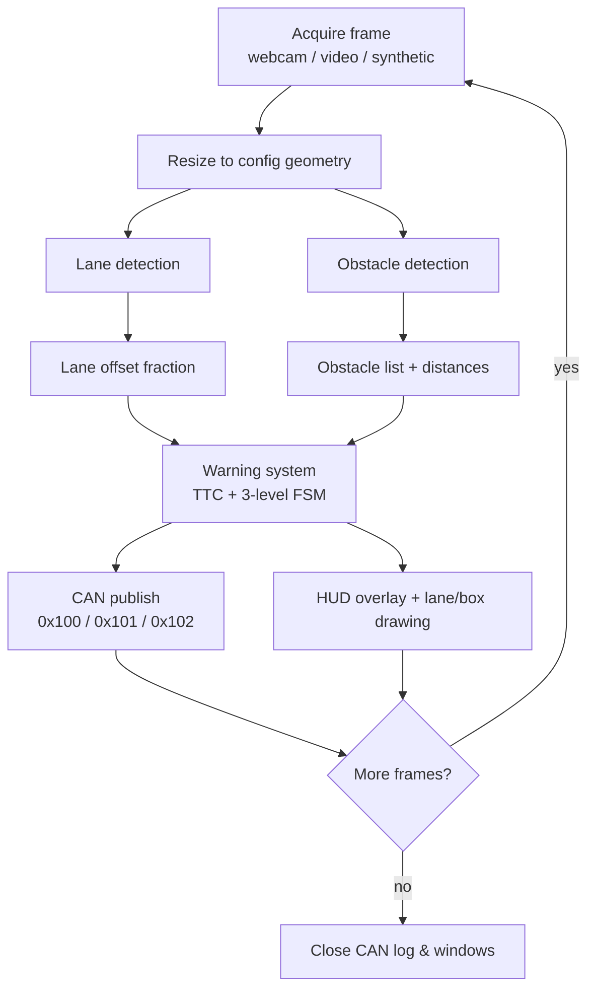
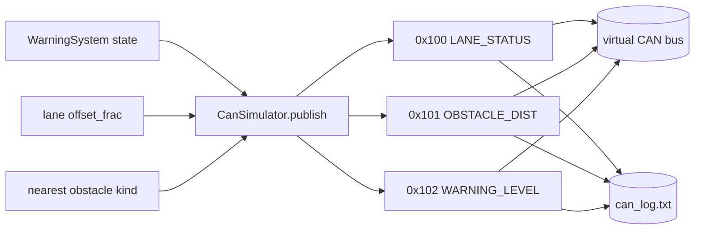

# Basic ADAS (Advanced Driver Assistance System) Prototype

> Author: **Nguyen Dang Anh Tai** ([@anhtai2222](https://github.com/anhtai2222))

A fully runnable, simulation-ready ADAS prototype built with Python + OpenCV.
It performs **lane detection**, **obstacle detection** (pedestrians + vehicles),
**collision warning** with a 3-level alert state machine, a **virtual CAN bus**
broadcast of the resulting signals, and a **heads-up display (HUD)** overlay —
all running on a plain laptop with nothing more than a webcam, a video file, or
the built-in synthetic road simulator. **No special hardware required.**

```
adas_prototype/
├── main.py                   # Entry point, arg parsing, capture loop
├── config.py                 # ALL tunable parameters (no magic numbers elsewhere)
├── modules/
│   ├── lane_detection.py     # Canny + ROI + Hough line transform
│   ├── obstacle_detection.py # HOG pedestrian + MOG2 contour vehicle detector
│   ├── warning_system.py     # TTC calc + 3-level alert state machine + beep
│   ├── can_sim.py            # python-can virtual bus + can_log.txt
│   └── hud.py                # Semi-transparent HUD overlay
├── simulation/
│   └── sim_runner.py         # Synthetic road video + headless runner (CI)
├── tests/
│   ├── test_lane.py
│   └── test_obstacle.py
├── assets/
│   └── sample_video.mp4      # Placeholder note (see file)
├── requirements.txt
└── README.md
```

---

# Theory & Background

## 1. Lane Detection Theory

The lane pipeline is the classic *edge → region → line* approach:
`grayscale → Gaussian blur → Canny → ROI mask → Hough → lane fit`.

### Canny Edge Detection

Canny is a multi-stage optimal edge detector:

1. **Noise reduction** — convolve with a Gaussian kernel `G(x,y)` to suppress
   spurious gradients. Edges are high-frequency; so is noise, so we blur first.
2. **Gradient computation** — apply Sobel operators to get the gradient
   components `Gx`, `Gy`, then the **gradient magnitude** and **direction**:

   ```
   |G| = sqrt(Gx² + Gy²)        θ = atan2(Gy, Gx)
   ```

3. **Non-Maximum Suppression (NMS)** — thin the edges: keep a pixel only if its
   gradient magnitude is a local maximum along the gradient direction. This
   turns thick gradient ridges into 1-pixel-wide edges.
4. **Double threshold + hysteresis** — classify pixels using two thresholds
   (`canny_low`, `canny_high`):
   - `|G| ≥ high` → **strong** edge (kept).
   - `low ≤ |G| < high` → **weak** edge (kept *only if* connected to a strong
     edge).
   - `|G| < low` → discarded.

   Hysteresis is what makes Canny robust: it links broken edge fragments
   without admitting isolated noise.

### Hough Line Transform

A line in image space `y = m·x + b` is awkward (vertical lines → infinite
slope). The Hough transform uses the **polar / normal form**:

```
ρ = x·cos(θ) + y·sin(θ)
```

where **ρ** is the perpendicular distance from the origin to the line and
**θ** is the angle of that perpendicular. Each edge pixel `(x, y)` votes for
every `(ρ, θ)` line that could pass through it, tracing a sinusoid in the
`(ρ, θ)` accumulator. **Collinear pixels produce sinusoids that intersect at a
common `(ρ, θ)` cell** — peaks in the accumulator are lines.

This project uses the **probabilistic** variant `cv2.HoughLinesP`, which returns
finite line *segments* `(x1, y1, x2, y2)` and is faster because it votes with a
random subset of edge pixels. Segments are then split into **left** (negative
slope, since image *y* grows downward) and **right** (positive slope) groups,
slope-filtered to reject near-horizontal clutter, and averaged into one line per
side via least-squares of `(slope, intercept)`.

### ROI Polygon Rationale

We only care about the road directly ahead, not the sky, dashboard, or
roadside. A **trapezoidal Region Of Interest** — wide at the bottom of the
frame, narrowing toward the vanishing point at the horizon — matches the
perspective geometry of a forward-facing camera. Masking everything outside it
before the Hough vote removes the vast majority of irrelevant edges, which both
speeds up detection and dramatically reduces false lines. The ROI vertices are
expressed as *fractions* of the frame in `config.py` so they scale with
resolution.

## 2. Obstacle Detection Theory

### HOG Descriptor (pedestrians)

**Histogram of Oriented Gradients** describes local object appearance by the
distribution of edge orientations, which is robust to lighting and small
deformations — ideal for the human silhouette. Pipeline:

1. **Gradients** — compute `Gx`, `Gy`, magnitude, and orientation per pixel.
2. **Cell histograms** — divide the detection window into small **cells**
   (e.g. 8×8 px). Within each cell, build a histogram of gradient orientations
   (typically 9 bins over 0–180°), each pixel voting with its gradient
   *magnitude*.
3. **Block normalization** — group cells into overlapping **blocks** (e.g.
   2×2 cells) and normalize the concatenated histogram. OpenCV's default uses
   **L2-Hys** normalization: L2-normalize, clip values to a maximum (default
   0.2), then L2-normalize again. This provides invariance to illumination and
   contrast.
4. **Classification** — the normalized block descriptors are concatenated into
   one feature vector and fed to a **linear SVM**. OpenCV ships a pre-trained
   people detector via `cv2.HOGDescriptor_getDefaultPeopleDetector()`, scanned
   over the image at multiple scales (`detectMultiScale`).

### Background Subtraction — MOG2 (vehicles / moving blobs)

**MOG2** models each pixel's recent history as a **Mixture of Gaussians**.
Persistent values (road, static background) are explained by the dominant
Gaussian components; a new pixel value that doesn't fit any component is labeled
**foreground** (a moving object). MOG2 adapts the number of Gaussians per pixel
automatically and includes optional **shadow detection** (marked as gray ~127,
which we threshold away). After subtraction we apply morphological
**open → close** to remove speckle and fill holes, then extract **contours** and
keep those above `min_contour_area`, treating each as a candidate vehicle.

### Distance Estimation — Pinhole Camera Model

Using the **pinhole camera model**, an object of real-world height `H` projects
to a bounding-box height `h` (pixels) at distance `d`:

```
        f · H
   d = ───────
          h
```

where `f` is the camera **focal length in pixels**. Distance is therefore
**inversely proportional to box height** — objects shrink as they recede. The
focal length and assumed object heights (1.7 m pedestrian, 1.5 m vehicle) live
in `config.py`; for real metric accuracy you would calibrate `f` with a
checkerboard (`cv2.calibrateCamera`). Estimates are clamped to a sane
`[min, max]` metre range.

## 3. TTC (Time-To-Collision)

Time-To-Collision is the time until the ego vehicle reaches an obstacle if both
keep their current relative motion:

```
              d
   TTC = ───────────
          v_rel
```

`d` is the estimated distance and `v_rel` the **relative closing speed**. When a
per-object speed isn't measured, the prototype uses a relative speed derived
from the simulated ego speed (configurable), floors it to avoid divide-by-zero,
and caps the result at `max_ttc_s`. TTC is the central trigger for the **DANGER**
level: a far object closing fast can be more urgent than a near static one.

### Sensor Fusion Rationale

A single sensor is never enough in production ADAS. Camera vision gives rich
classification (pedestrian vs. vehicle, lane geometry) but **poor absolute
depth**; radar gives excellent range and closing-speed but **poor classification**;
lidar gives precise 3-D structure but is costly and weather-sensitive. **Sensor
fusion** combines them — e.g. radar range + camera classification — so each
sensor covers the others' weaknesses, yielding more reliable distance, TTC, and
object identity than any one alone. This prototype fuses two *vision* cues
(HOG appearance + MOG2 motion) as a software stand-in for that principle.

## 4. CAN Bus in ADAS

### CAN Frame Structure

The **Controller Area Network (CAN)** is the dominant in-vehicle bus. A standard
data frame carries:

| Field            | Size       | Purpose                                          |
|------------------|------------|--------------------------------------------------|
| SOF              | 1 bit      | Start of frame                                   |
| **Arbitration ID** | 11 bit   | Message identifier **and** priority (lower = higher priority) |
| Control / **DLC** | 4 bit     | Data Length Code: number of data bytes (0–8)     |
| **Data**         | 0–8 bytes  | Payload                                          |
| CRC              | 15 bit     | Cyclic redundancy check                          |
| ACK              | 1 bit      | Acknowledge slot                                 |
| EOF              | 7 bit      | End of frame                                     |

### Why CAN in Automotive

- **Deterministic priority** — bitwise arbitration on the ID means the
  highest-priority message always wins the bus without corruption or delay;
  critical safety messages get through predictably.
- **Fault tolerance** — differential signaling (CAN-H / CAN-L) rejects
  electrical noise, and built-in CRC + ACK + automatic re-transmission detect
  and recover from errors. Nodes that misbehave are progressively isolated
  (error-active → passive → bus-off).
- **Multi-master broadcast** — any ECU can transmit; messages are addressed by
  *content* (ID), not destination, so adding a listener requires no rewiring.
- **Low cost & mature** — two wires, decades of tooling and silicon.

### CAN IDs Used in This Project

| Signal           | CAN ID  | DLC | Payload encoding                                                |
|------------------|---------|-----|-----------------------------------------------------------------|
| `LANE_STATUS`    | `0x100` | 2   | `byte0`=status (0 ok / 1 drift / 2 departure); `byte1`=\|offset\| % of width |
| `OBSTACLE_DIST`  | `0x101` | 3   | `byte0..1`=distance in cm (uint16, big-endian); `byte2`=kind (0 none / 1 ped / 2 vehicle) |
| `WARNING_LEVEL`  | `0x102` | 2   | `byte0`=level (0 safe / 1 caution / 2 danger); `byte1`=TTC in tenths of a second |

Every transmitted frame is also appended to **`can_log.txt`** as CSV
(`timestamp_s, can_id, dlc, data_hex, decoded`). If `python-can` is not
installed, the simulator transparently falls back to **log-only mode** so the
rest of the pipeline keeps running.

---

# Flowcharts

## Main Processing Loop (Mermaid)



## Lane Detection Pipeline


```
ASCII view of the same pipeline:

 frame ─► gray ─► blur ─► Canny ─► [ ROI mask ] ─► Hough ─► slope split
                                                                │
                              left line  ◄──── average ◄────────┤
                              right line ◄──── average ◄────────┘
                                   │
                                   ▼
                       lane_center  vs  frame_center  ─►  offset_frac
```

## Warning State Machine

```mermaid
stateDiagram-v2
    [*] --> SAFE
    SAFE --> CAUTION : obstacle < 5m  OR  2s ≤ TTC < 4s  OR  mild lane drift
    SAFE --> DANGER  : obstacle < 3m  OR  TTC < 2s  OR  large lane departure
    CAUTION --> DANGER : threat escalates
    CAUTION --> SAFE   : threat clears
    DANGER --> CAUTION : threat eases
    DANGER --> SAFE    : all clear

    note right of DANGER
      Red flashing border @ flash_hz
      + audible beep (pygame)
      + CAN WARNING_LEVEL = 2
    end note
```



## CAN Message Flow



---

# Setup & Run

## Requirements

- **Python 3.10 – 3.12**
- A webcam *or* a video file *or* nothing at all (simulation mode).
- OS: Linux or Windows (also works on macOS).

Pinned dependencies (`requirements.txt`):

| Package          | Version       | Required? | Used for                          |
|------------------|---------------|-----------|-----------------------------------|
| `numpy`          | 1.26.4        | yes       | array math                        |
| `opencv-python`  | 4.10.0.84     | yes       | all CV (lanes, HOG, MOG2, drawing)|
| `python-can`     | 4.4.2         | optional  | virtual CAN bus (falls back to log-only) |
| `pygame`         | 2.6.1         | optional  | DANGER audio beep (silently skipped if absent) |
| `pytest`         | 8.3.3         | dev/test  | test suite                        |

> The prototype is designed to **degrade gracefully**: if `python-can` or
> `pygame` are missing, it logs a warning and keeps running (CAN to file only,
> no audio). Only `numpy` and `opencv-python` are strictly required.

## Installation

```bash
cd adas_prototype
python -m venv .venv
# Linux/macOS:
source .venv/bin/activate
# Windows (PowerShell):
# .venv\Scripts\Activate.ps1

pip install -r requirements.txt
```

## Run with Webcam

```bash
python main.py --webcam
# choose a different camera device:
python main.py --webcam --camera-index 1
```

Press **`q`** in the window to quit.

## Run with a Video File

```bash
python main.py --video assets/sample_video.mp4
```

(See `assets/sample_video.mp4` — it is a placeholder note explaining how to
supply or generate a real clip.)

## Run Simulation Mode

No camera or file needed — a synthetic road is generated internally:

```bash
# with a live window:
python main.py --simulate

# fully headless (CI / servers), capped frame count:
python main.py --simulate --headless --max-frames 100
```

You can also run the simulator module directly:

```bash
python -m simulation.sim_runner
```

After any run, inspect the generated **`can_log.txt`** to see the broadcast CAN
traffic.

## Run Tests

```bash
python -m pytest -q
```

---

# Results & Limitations

## What Works

- **End-to-end pipeline runs headless** with only `numpy` + `opencv-python`
  installed. A 60-frame simulation produces 180 CAN frames (3 signals × 60
  frames) logged to `can_log.txt`, and the full test suite (**18 tests**)
  passes.
- **Lane detection** reliably finds straight/gently-curving painted lanes under
  good contrast and reports a signed lateral `offset_frac` that drives the
  departure warning.
- **Obstacle detection** combines HOG pedestrians with MOG2 motion blobs, each
  annotated with a pinhole distance estimate; TTC and the 3-level warning state
  machine respond correctly to distance, closing speed, and lane drift (verified
  by unit tests).
- **Graceful degradation**: missing `python-can`/`pygame` never crash the run.

## Limitations

- **Lane geometry** — the Hough/slope-averaging approach assumes mostly straight
  lanes. Sharp curves, faded/occluded markings, crossings, and harsh shadows
  reduce accuracy. A perspective-warp + **sliding-window polynomial fit** (as
  outlined in the module) would handle curves better.
- **Distance is approximate** — the pinhole estimate depends on an *assumed*
  object height and an *uncalibrated* focal length. Treat metres as relative,
  not survey-grade. Calibrate `f` (`cv2.calibrateCamera`) for real numbers.
- **TTC uses a global relative speed** when no per-object speed is measured;
  there is no real object tracking/velocity estimation (no Kalman/optical-flow
  association across frames).
- **HOG pedestrian detector** is a classic baseline: slower and less accurate
  than modern CNNs, with false positives in cluttered scenes. For higher
  accuracy, swap in **YOLO-tiny** (e.g. `cv2.dnn` with a tiny-YOLO `.weights`/
  `.cfg`, or `ultralytics`) behind the same `ObstacleDetector` interface.
- **MOG2** flags *any* motion, including the first frame (cold model) and
  illumination changes; it cannot distinguish vehicle types and needs a few
  frames to warm up.
- **Single-camera, monocular** — no radar/lidar fusion, so depth and closing
  speed are inherently weaker than a production multi-sensor stack.
- **Simulation-grade only** — this is an educational prototype, **not** a
  safety-certified system and must never be relied upon for actual driving.

## Suggested Extensions

1. Sliding-window + polynomial lane fit on a bird's-eye (perspective) warp.
2. YOLO-tiny / `cv2.dnn` object detector option behind the existing interface.
3. Object tracking (SORT / Kalman) for true per-object velocity and TTC.
4. Real CAN hardware via `socketcan` (just change `interface`/`channel` in
   `config.py`).
5. Camera calibration workflow to replace the assumed focal length.
```
